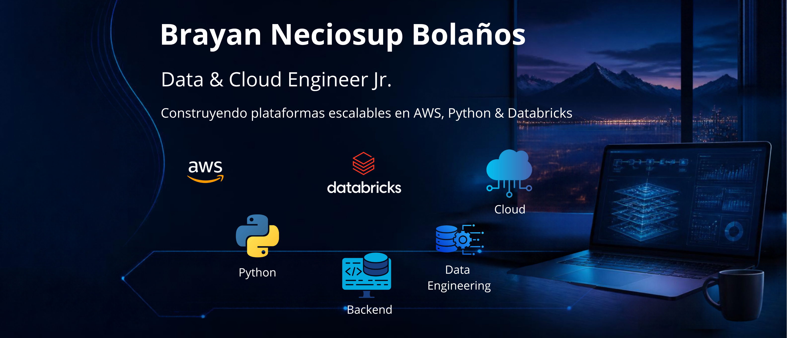

## ¡Bienvenido! 👋💻

* System Engineer 💻 || Data & Cloud Engineer 📊☁️|| Backend Dev - Python </> 🐍💻
* Me gusta explicar temas complejos a través de mis proyectos/series ✍️🧠.
* En preparación para Solution Architect Associate - AWS ☁️
* Compartir el conocimiento adquirido es escencial ✍️🧠

## 🌐 Socials 
  

## Certifications 📝

## Tech Stack
### 📊 Data Engineering

    
 

### Cloud Engineering ☁️
     

### Backend Developer ⚡</> 

     

### 🏗️ Data Architecture

## Top Languages

